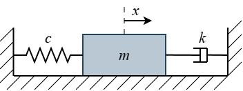
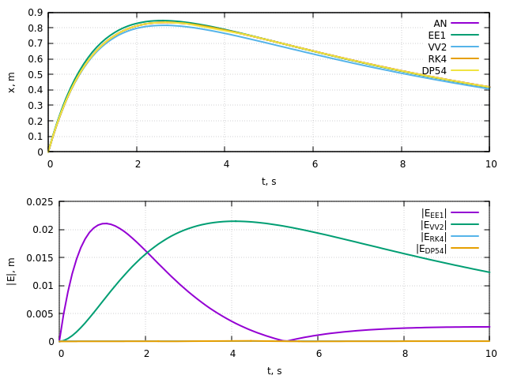

# nmsd

Numerical solutions of the Mass-Spring-Damper model.



## Quickstart

```bash
cc nmsd.c -o nmsd -lm
./nmsd && gnuplot -p nmsd.plt
```

> [!WARNING]
> This document lacks many important details. Its purpose is to lay down the basic ideas.
> To fully understand the presented material, the suggested papers/books must be studied.

## Implementation

The choice of the "cryptic," old style is deliberate. It serves three purposes:

+ C is an old but easy-to-learn language that can be compiled even on embedded systems. It is an efficient language, meaning it is favorable for numerical methods and it does not hide the implementation details.
+ Declaring the variables at the top of the function makes the algorithms less noisy, in my opinion.
+ The cryptic variable names prepare the reader: many numerical methods have useful old C/FORTRAN implementations to study, but they use the same "cryptic" style because of the limitations of their time.

> [!WARNING]
> The implementation of the methods is **not** general. They are capable of solving **only a second order differential equation**,
> but they can be easily modified to extend their capabilities.
  
## Explanation

The Mass-Spring-Damper model describes a 1-degree-of-freedom mechanical system consisting of a mass, a spring and a damper.
The equation of motion of the unforced system:
```math
m\ddot{x} + k\dot{x} + cx = 0
```
where $m$ is the **mass** $k$ is the **damping coefficient** and $c$ is the **stiffness of the spring**. To solve this equation, we have to find the $x(t)$ **displacement from the equilibrium position**.

The governing equation is a **2nd order linear homogeneous differential equation with constant coefficients**.
There are many ways to solve this equation numerically, only a few will be presented in this document and their implementation can be found in the accompanying *nmsd.c* file.

### Analytical Solution (`an()`)

We can solve this equation analytically, this will be the base-line for the comparison of different numerical methods.

Let's introduce the **damping constant** $\beta = \frac{k}{2m}$ and the **natural frequency** $\omega = \sqrt{\frac{c}{m}}$ and assume that the solution $x(t)$ is in a form of $e^{\lambda t}$.
We can rewrite the equation:
```math
\lambda^2 e^{\lambda t} + 2 \beta \lambda e^{\lambda t} + \omega^2 e^{\lambda t} = 0
```
after regrouping we get:
```math
\left( \lambda^2 + 2 \beta \lambda + \omega^2 \right) e^{\lambda t} = 0
```
since $e^{\lambda t}$ cannot be $0$, we can divide by it to arrive at the **characteristic equation**:
```math
\lambda^2 + 2 \beta \lambda + \omega^2 = 0
```
which is a **quadratic equation**. To solve it we can use the **quadratic formula**:
```math
\lambda_{1,2} = -\beta \pm \sqrt{\beta^2 - \omega^2}
```
Since the original equation is **linear**, the general solution is:
```math
x(t) = c_1 e^{\lambda_1 t} + c_2 e^{\lambda_2 t}
```
The $c_1$ and $c_2$ constants can be determined from the **initial conditions**: the **initial position** $x_0$  and the **initial velocity** $v_0$:
```math
x(t=0) = x_0 = c_1 + c_2
```
```math
\dot{x}(t=0) = v_0 =  c_1 \lambda_1 + c_2 \lambda_2
```

> [!NOTE]
> Suggested material:
> 
> Boyce W.E., DiPrima R.C., Meade D.B. (2017): Elementary Differential Equations and Boundary Value Problems, ISBN 978-1-119-37792-4
>  + Chapter 3: Second-Order Linear Differential Equations
>
> Thomson W.T. (1993): Theory of Vibration with Applications, ISBN 0-7487-4380-4    
>  + Chapter 2.6: Viscously Damped Free Vibration

### Explicit Euler method (`ee1()`)

The explicit Euler method (also called the forward Euler method) is a numerical procedure for solving ordinary differential equations with a given initial value.

Let's recall the defintion of the **derivative**:
```math
\frac{\mathrm{d}x}{\mathrm{d}t} = \lim_{\Delta t \to 0} \frac{x(t+\Delta t) - x(t)} {\Delta t}
```
assuming $\Delta t$ is sufficiently **small**:
```math
\frac{\mathrm{d}x}{\mathrm{d}t} \approx \frac{x(t+\Delta t) - x(t)}{\Delta t}
```
after some rearrangement, we get:
```math
x(t+\Delta t) \approx x(t) + \Delta t \frac{\mathrm{d}x}{\mathrm{d}t}
```
where $\Delta t$ is the **step size** or **time step**.

This is why it is called an **explicit** method, because the calculation of the solution at the next time step is based only on the information that is already known (the current time step).

Since $\Delta t$ is **not** infinitesimally small, there is always an error. The **global truncation error** of Euler’s method is of order 
$\Delta t$, which we write as $O(\Delta t)$. The Euler method is therefore a **first order** numerical method.

The Euler method can solve the following problem:

```math
\frac{\mathrm{d}x}{\mathrm{d}t} = f(t, x), x(t_0) = x_0
```
which is a **first order** ordinary differential equation with a given initial value, but we want to solve a **second order** ordinary differential equation.
We can transform our original equation to a **first order system of differential equations** as follows:

We introduce the **state vector**:
```math
\underline{x} =
\begin{bmatrix}
x_0\\
x_1
\end{bmatrix} =
\begin{bmatrix}
x\\
\dot{x}
\end{bmatrix}
```

meaning the derivative of this vector becomes:

```math
\underline{\dot{x}} =
\begin{bmatrix}
\dot{x}\\
\ddot{x}
\end{bmatrix}
```

so the original equation can be written as:

```math
\underline{\dot{x}} = \boldsymbol{f}(t, \underline{x})
```

```math
\begin{bmatrix}
\dot{x}\\
\ddot{x}
\end{bmatrix}
=
\begin{bmatrix}
x_1\\
\frac{1}{m} (-kx_1 - c x_0)
\end{bmatrix}
```
This is the `msd()` function defined in the source code.

This transformation allows us to use the Euler method to solve our problem by applying it to **each** equation in the system given the
```math
\begin{bmatrix}
x(t_0)\\
\dot{x}(t_0)
\end{bmatrix}
=
\begin{bmatrix}
x_0\\
v_0
\end{bmatrix}
```
initial conditions.

This method is often used in simpler video games as a base of the physics engine due to its simplicity and speed for a first-pass or low-complexity physics systems.

> [!NOTE]
> Suggested material:
> 
> Iserles A. (2009): A First Course in the Numerical Analysis of Differential Equations, ISBN 978-0-511-50637-6
>  + Chapter 1.2: Euler’s method
>
> Teschl G. (2012): Ordinary Differential Equations and Dynamical Systems, ISBN 978-0821883280   
>  + Chapter 3.2: Linear autonomous first-order systems
>  + Chapter 3.3: Linear autonomous equations of order $n$
>
> Millington I. (2007): Game Physics Engine Development, ISBN 978-0-12-381976-5
>  + Chapter 3.3: The Integrator

### Classic Runge-Kutta method (`rk4()`)

Since the error is dependent of the time step, one way to reduce this error is to evaluate the function more times in one time step. This is the basic idea of the **explicit Runge-Kutta method**.
It achieves this by computing the $k_i$ **stage derivaties** as follows:

```math
k_1 = f(t, x)
```
```math
k_2 = f \left( t + \frac{\Delta t}{2}, x + \frac{\Delta t }{2} k_1 \right)
```
```math
k_3 = f \left( t + \frac{\Delta t}{2}, x + \frac{\Delta t }{2} k_2 \right)
```
```math
k_4 = f(t + \Delta t, x + \Delta t k_3)
```

and using them to compute the final result:

```math
x(t+\Delta t) \approx x(t) + \Delta t \left( \frac{k_1}{6} + \frac{k_2}{3} + \frac{k_3}{3} + \frac{k_4}{6} \right)
```

This method evaluates the function **4 times**.

A more compact notation of these steps is the **Butcher tableau**:

<table style="border-collapse: collapse; margin-left: auto; margin-right: auto; text-align: center;">
  <tr>
    <td style="padding: 5px;">$0$</td>
    <td style="width: 2px; background-color: black; padding: 0;"></td>
    <td style="padding: 5px;"></td>
    <td style="padding: 5px;"></td>
    <td style="padding: 5px;"></td>
    <td style="padding: 5px;"></td>
  </tr>
  <tr>
    <td style="padding: 5px;">$\frac{1}{2}$</td>
    <td style="width: 2px; background-color: black; padding: 0;"></td>
    <td style="padding: 5px;">$\frac{1}{2}$</td>
    <td style="padding: 5px;"></td>
    <td style="padding: 5px;"></td>
    <td style="padding: 5px;"></td>
  </tr>
  <tr>
    <td style="padding: 5px;">$\frac{1}{2}$</td>
    <td style="width: 2px; background-color: black; padding: 0;"></td>
    <td style="padding: 5px;">$0$</td>
    <td style="padding: 5px;">$\frac{1}{2}$</td>
    <td style="padding: 5px;"></td>
    <td style="padding: 5px;"></td>
  </tr>
  <tr>
    <td style="padding: 5px;">$1$</td>
    <td style="width: 2px; background-color: black; padding: 0;"></td>
    <td style="padding: 5px;">$0$</td>
    <td style="padding: 5px;">$0$</td>
    <td style="padding: 5px;">$1$</td>
    <td style="padding: 5px;"></td>
  </tr>
  <tr>
    <td style="height: 2px; background-color: black; padding: 0;"></td>
    <td style="height: 2px; width: 2px; background-color: black; padding: 0;"></td>
    <td style="height: 2px; background-color: black; padding: 0;"></td>
    <td style="height: 2px; background-color: black; padding: 0;"></td>
    <td style="height: 2px; background-color: black; padding: 0;"></td>
    <td style="height: 2px; background-color: black; padding: 0;"></td>
  </tr>
  <tr>
    <td style="padding: 5px;"></td> 
    <td style="width: 2px; background-color: black; padding: 0;"></td>
    <td style="padding: 5px;">$\frac{1}{6}$</td>
    <td style="padding: 5px;">$\frac{1}{3}$</td>
    <td style="padding: 5px;">$\frac{1}{3}$</td>
    <td style="padding: 5px;">$\frac{1}{6}$</td>
  </tr>
</table>

The explicit Runge-Kutta method is a **fourth-order method** ( $O(\Delta t^4)$ ) and commonly used due to its ideal **balance** of accuracy and computational cost.
It is sometimes called the "classic" Runge-Kutta method due to its historical significance.

> [!NOTE]
>
> Suggested material:
> 
> Runge C.D.T. (1895): Über die numerische Auflösung von Differentialgleichungen, DOI 10.1007/BF01446807
> 
> Kutta W. (1901): Beitrag zur näherungsweisen Integration totaler Differentialgleichungen, Zeitschrift für Mathematik und Physik, 46, pp. 435–453
> 
> Butcher J.C. (1965): On the Attainable Order of Runge-Kutta Methods, DOI 10.2307/2003670 
>
> Hairer E., Norsett S.P., Wanner G. (1993): Solving Ordinary Differential Equations I: Nonstiff Problems, ISBN 978-3-540-56670-0
>  + Chapter II.1: The First Runge-Kutta Methods

### Dormand–Prince method (`dp54()`)

The other method to improve the accuracy of the numerical method is to decrease the step size, but this leads to an increase of the numerical computation needed.
An other aspect is that we change the step size to improve the **accuracy**; this is what we want to control.
This is why the **adaptive step** or **variable step** methods were born: the **embedded Runge-Kutta** methods.
The idea is that we use $p$-order method for the solution and a $\hat{p}$-order method for **error estimation** (usually $\hat{p} = p - 1$).
The difference between the result of the methods yields **the local error** and based on this error we choose the appropriate step size:
  + if the solution is accepted: increase the step size, to avoid unnecessary computation,
  + otherwise: decrease the step size and rerun the calculation.
    
This way we directly control the error by ensuring it remains below the combined threshold defined by the **absolute tolerance** and the **relative tolerance**.

The **Dormand–Prince method** is a **fifth-order** method with a **fourth-order** error estimation. The **Butcher tableau** of the method:

<table style="border-collapse: collapse; margin-left: auto; margin-right: auto; text-align: center;">
  <tr>
    <td style="padding: 5px;">$0$</td>
    <td style="width: 2px; background-color: black; padding: 0;"></td>
    <td style="padding: 5px;"></td>
    <td style="padding: 5px;"></td>
    <td style="padding: 5px;"></td>
    <td style="padding: 5px;"></td>
    <td style="padding: 5px;"></td>
    <td style="padding: 5px;"></td>
    <td style="padding: 5px;"></td>
  </tr>
  
  <tr>
    <td style="padding: 5px;">$\frac{1}{5}$</td>
    <td style="width: 2px; background-color: black; padding: 0;"></td>
    <td style="padding: 5px;">$\frac{1}{5}$</td>
    <td style="padding: 5px;"></td>
    <td style="padding: 5px;"></td>
    <td style="padding: 5px;"></td>
    <td style="padding: 5px;"></td>
    <td style="padding: 5px;"></td>
    <td style="padding: 5px;"></td>
  </tr>
  
  <tr>
    <td style="padding: 5px;">$\frac{3}{10}$</td>
    <td style="width: 2px; background-color: black; padding: 0;"></td>
    <td style="padding: 5px;">$\frac{3}{40}$</td>
    <td style="padding: 5px;">$\frac{9}{40}$</td>
    <td style="padding: 5px;"></td>
    <td style="padding: 5px;"></td>
    <td style="padding: 5px;"></td>
    <td style="padding: 5px;"></td>
    <td style="padding: 5px;"></td>
  </tr>
  
  <tr>
    <td style="padding: 5px;">$\frac{4}{5}$</td>
    <td style="width: 2px; background-color: black; padding: 0;"></td>
    <td style="padding: 5px;">$\frac{44}{45}$</td>
    <td style="padding: 5px;">$-\frac{56}{15}$</td>
    <td style="padding: 5px;">$\frac{32}{9}$</td>
    <td style="padding: 5px;"></td>
    <td style="padding: 5px;"></td>
    <td style="padding: 5px;"></td>
    <td style="padding: 5px;"></td>
  </tr>
  
  <tr>
    <td style="padding: 5px;">$\frac{8}{9}$</td>
    <td style="width: 2px; background-color: black; padding: 0;"></td>
    <td style="padding: 5px;">$\frac{19372}{6561}$</td>
    <td style="padding: 5px;">$-\frac{25360}{2187}$</td>
    <td style="padding: 5px;">$\frac{64448}{6561}$</td>
    <td style="padding: 5px;">$-\frac{212}{729}$</td>
    <td style="padding: 5px;"></td>
    <td style="padding: 5px;"></td>
    <td style="padding: 5px;"></td>
  </tr>
  
  <tr>
    <td style="padding: 5px;">$1$</td>
    <td style="width: 2px; background-color: black; padding: 0;"></td>
    <td style="padding: 5px;">$\frac{9017}{3168}$</td>
    <td style="padding: 5px;">$-\frac{355}{33}$</td>
    <td style="padding: 5px;">$\frac{46732}{5247}$</td>
    <td style="padding: 5px;">$\frac{49}{176}$</td>
    <td style="padding: 5px;">$-\frac{5103}{18656}$</td>
    <td style="padding: 5px;"></td>
    <td style="padding: 5px;"></td>
  </tr>
  
  <tr>
    <td style="padding: 5px;">$1$</td>
    <td style="width: 2px; background-color: black; padding: 0;"></td>
    <td style="padding: 5px;">$\frac{35}{384}$</td>
    <td style="padding: 5px;">$0$</td>
    <td style="padding: 5px;">$\frac{500}{1113}$</td>
    <td style="padding: 5px;">$\frac{125}{192}$</td>
    <td style="padding: 5px;">$-\frac{2187}{6784}$</td>
    <td style="padding: 5px;">$\frac{11}{84}$</td>
    <td style="padding: 5px;"></td>
  </tr>
  
  <tr>
    <td style="height: 2px; background-color: black; padding: 0;"></td>
    <td style="height: 2px; width: 2px; background-color: black; padding: 0;"></td>
    <td style="height: 2px; background-color: black; padding: 0;"></td>
    <td style="height: 2px; background-color: black; padding: 0;"></td>
    <td style="height: 2px; background-color: black; padding: 0;"></td>
    <td style="height: 2px; background-color: black; padding: 0;"></td>
    <td style="height: 2px; background-color: black; padding: 0;"></td>
    <td style="height: 2px; background-color: black; padding: 0;"></td>
    <td style="height: 2px; background-color: black; padding: 0;"></td>
  </tr>

  <tr>
    <td style="padding: 5px;">$x$</td>
    <td style="width: 2px; background-color: black; padding: 0;"></td>
    <td style="padding: 5px;">$\frac{35}{384}$</td>
    <td style="padding: 5px;">$0$</td>
    <td style="padding: 5px;">$\frac{500}{1113}$</td>
    <td style="padding: 5px;">$\frac{125}{192}$</td>
    <td style="padding: 5px;">$-\frac{2187}{6784}$</td>
    <td style="padding: 5px;">$\frac{11}{84}$</td>
    <td style="padding: 5px;">0</td>
  </tr>
  
  <tr>
    <td style="padding: 5px;">$\hat{x}$</td> 
    <td style="width: 2px; background-color: black; padding: 0;"></td>
    <td style="padding: 5px;">$\frac{5179}{57600}$</td>
    <td style="padding: 5px;">$0$</td>
    <td style="padding: 5px;">$\frac{7571}{16695}$</td>
    <td style="padding: 5px;">$\frac{393}{640}$</td>
    <td style="padding: 5px;">$-\frac{92097}{339200}$</td>
    <td style="padding: 5px;">$\frac{187}{2100}$</td>
    <td style="padding: 5px;">$\frac{1}{40}$</td>
  </tr>
</table>

This method is widely used in **scientific computing**; for example this is the default method of the MATLAB/Simulink software (`ode45`).

> [!NOTE]
>
> Suggested material:
> 
> Dormand J.R., Prince P.J. (1980): A family of embedded Runge-Kutta formulae, DOI 10.1016/0771-050X(80)90013-3
>
> Hairer E., Norsett S.P., Wanner G. (1993): Solving Ordinary Differential Equations I: Nonstiff Problems, ISBN 978-3-540-56670-0
>  + Chapter II.4: Automatic Step Size Control
>  + Chapter II.4: Starting Step Size
>  + Chapter II.5: Embedded Formulas of Order 5
>
> Shampine L., Reichelt M. (1997): The MATLAB ODE Suite, DOI 10.1137/S1064827594276424

### Velocity-Verlet method (`vv2()`)

The Verlet integration is a numerical method designed to integrate Newton's equations of motion:

```math
\ddot{x} = \boldsymbol{a}(x)
```
where $a$ is the position-dependent **acceleration**. The original Verlet method cannot solve the *MSD* system since its acceleration depends on the velocity:

```math
\ddot{x} = \boldsymbol{a}(x, \dot{x})
```

The **Velocity-Verlet method** can solve the system using the following steps:

1) Calculate acceleration in the current time step
2) Update the half-step velocity
```math
  v \left(t + \frac{1}{2} \Delta t \right) = v(t) + \frac{1}{2}a(t) \Delta t
```
3) Update position with the half-step velocity
```math
  x (t + \Delta t) = x(t) + v \left(t + \frac{1}{2} \Delta t \right) \Delta t
```
4) Calculate new acceleration
5) Update the full-step velocity
```math
  v (t + \Delta t) = v \left(t + \frac{1}{2} \Delta t \right) + \frac{1}{2}a(t + \Delta t) \Delta t
```

This method is a **second order** method.

It is often used in Discrete Element Method and Molecular Dynamics simulations due to its **stability** and **energy conservative** properties.

> [!NOTE]
>
> Suggested material:
> 
> Verlet L. (1967): Computer "Experiments" on Classical Fluids. I. Thermodynamical Properties of Lennard-Jones Molecules, DOI 10.1103/PhysRev.159.98
>
> Allen M.P., Tildesley D.J. (2017): Computer Simulation of Liquids, ISBN 978–0–19–880319–5
>  + Chapter 3.2.1: The Verlet algorithm
>
> Vyas D.R., Ottino J.M., Lueptow R.M., Umbanhowar P.B. (2025): Improved velocity-Verlet algorithm for the discrete element method, DOI 10.1016/j.cpc.2025.109524

## Results

The results of the presented methods can be seen in the following image, where the **displacement** $x(t)$ and the **absolute error** $|an(t) - \bar{x}(t)|$ are shown.




